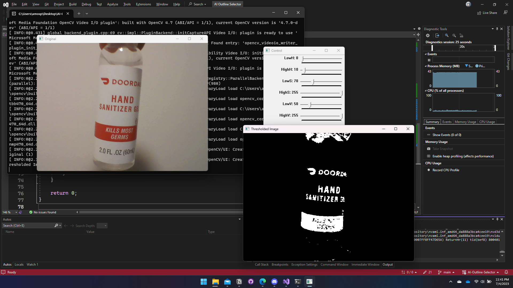

# Color Detector Using OpenCV and C++




## Description

This is a color detection project that uses OpenCV library in C++. The program captures video from a webcam and filters out a specific color range based on HSV (Hue, Saturation, Value) values. The range of these values can be adjusted dynamically with trackbars during program execution. The current HSV range is also saved into a text file.

## Setup and Run

1. **Prerequisite:** Ensure that you have installed OpenCV library and set it up with your C++ environment. If you haven't, you can follow the instructions provided [here](https://docs.opencv.org/master/d7/d9f/tutorial_linux_install.html) (for Linux) or [here](https://docs.opencv.org/master/d3/d52/tutorial_windows_install.html) (for Windows).

2. **Clone the repository:** Download or clone this repository into your local machine.

3. **Build the project:** Navigate to the project folder in your terminal or command prompt and run the necessary commands to compile the C++ code. If you are using `g++`, the command could look something like this:
    ```
    g++ main.cpp -o main `pkg-config --cflags --libs opencv`
    ```
    This command compiles `main.cpp` into an executable named `main`. The `pkg-config --cflags --libs opencv` part is used to include the necessary OpenCV libraries.

4. **Run the program:** Run the program with the following command:
    ```
    ./main
    ```


## Usage

1. **Running the Program:** After successfully building the project, run the program from your terminal or command prompt using the command `./main`. Ensure your webcam is connected and accessible.

2. **Understanding the GUI:** When the program starts, you will see three windows:
   - **Control:** This window contains six trackbars that you can interact with: `LowH`, `HighH`, `LowS`, `HighS`, `LowV`, `HighV`. These sliders represent the range of Hue, Saturation, and Value (HSV) that the color filter will accept.
   - **Original:** This window displays the original video feed from your webcam.
   - **Thresholded Image:** This window displays the processed video feed, where only colors within the HSV range are shown.

3. **Setting the HSV Range:** The sliders in the "Control" window are used to adjust the HSV range. Each slider adjusts one endpoint of the range for each component of the HSV color space:
   - **Hue (H):** Ranges from 0 to 179. LowH and HighH define the acceptable range for hue values.
   - **Saturation (S):** Ranges from 0 to 255. LowS and HighS define the acceptable range for saturation values.
   - **Value (V):** Ranges from 0 to 255. LowV and HighV define the acceptable range for brightness values.

   By adjusting these sliders, you can change the HSV range in real-time. This will immediately be reflected in the "Thresholded Image" window as it updates to filter the new color range.

4. **Viewing the Output:** In the "Thresholded Image" window, you will see the result of the color filtering. Only pixels from the webcam feed that are within the selected HSV range will be visible; all other pixels will be black.

5. **Saving HSV Values:** The current HSV range is written to `HSVvalues.txt` every frame. This file will contain six lines, each showing one value: LowH, HighH, LowS, HighS, LowV, HighV. You can refer to this file to know the HSV range that was last used in the program.

6. **Exiting the Program:** If you want to close the program, simply focus on one of the windows and press the 'esc' key. The program will terminate, and the final HSV range will be saved to `HSVvalues.txt`.

Please make sure to handle the webcam and files correctly in your operating system when using this program. Enjoy color detection with your own HSV range!

## Contributing

Pull requests are welcome. For major changes, please open an issue first to discuss what you would like to change.

Please make sure to update tests as appropriate.

## License

[MIT](https://choosealicense.com/licenses/mit/)